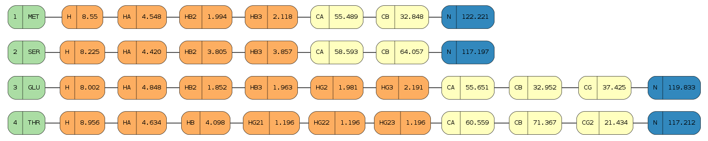

The nmrstarlib Tutorial
=======================

The :mod:`nmrstarlib` package provides classes and other facilities for parsing,
accessing, and manipulating data stored in NMR-STAR and JSONized NMR-STAR formats.
Also, the :mod:`nmrstarlib` package provides simple command-line interface.

Using nmrstarlib as a library
~~~~~~~~~~~~~~~~~~~~~~~~~~~~~

Importing nmrstarlib module
---------------------------

If the :mod:`nmrstarlib` package is installed on the system, the :mod:`nmrstarlib.nmrstarlib`
module can be imported:

>>> from nmrstarlib import nmrstarlib

Constructing StarFile generator
-------------------------------

The :mod:`~nmrstarlib.nmrstarlib` module provides the :func:`~nmrstarlib.nmrstarlib.read_files`
generator function that yields :class:`~nmrstarlib.nmrstarlib.StarFile` instances. Constructing a
:class:`~nmrstarlib.nmrstarlib.StarFile` generator is easy - specify the path to a local NMR-STAR file,
directory of NMR-STAR files, archive of NMR-STAR files or BMRB id:

>>> from nmrstarlib import nmrstarlib
>>>
>>> single_starfile = nmrstarlib.read_files("bmr18569.str")  # single NMR-STAR file
>>>
>>> starfiles = nmrstarlib.read_files("bmr18569.str", "bmr336.str") # several NMR-STAR files
>>>
>>> dir_starfiles = nmrstarlib.read_files("starfiles_dir")   # directory of NMR-STAR files
>>>
>>> arch_starfiles = nmrstarlib.read_files("starfiles.zip")  # archive of NMR-STAR files
>>>
>>> url_starfile = nmrstarlib.read_files("18569")            # BMRB id of NMR-STAR file
>>>

Processing StarFile generator
-----------------------------

The :class:`~nmrstarlib.nmrstarlib.StarFile` generator can be processed in several ways:

   * Feed it to a for-loop and process one file at a time:

   >>> for starfile in dir_starfiles:
   ...     print(starfile.bmrbid)                  # print BMRB id of StarFile
   ...     print(starfile.source)                  # print source of StarFile
   ...     for saveframe_name in starfile.keys():  # print saveframe names
   ...         print(saveframe_name)
   >>>

   .. note:: Once the generator is consumed, it becomes empty and needs to be created again.

   * Since the :class:`~nmrstarlib.nmrstarlib.StarFile` generator behaves like an iterator,
     we can call the :py:func:`next` built-in function:

   >>> starfile1 = next(dir_starfiles)
   >>> starfile2 = next(dir_starfiles)
   >>> ...

   .. note:: Once the generator is consumed, :py:class:`StopIteration` will be raised.

   * Convert the :class:`~nmrstarlib.nmrstarlib.StarFile` generator into a :py:class:`list` of
     :class:`~nmrstarlib.nmrstarlib.StarFile` objects:

   >>> starfiles_list = list(dir_starfiles)
   >>>

   .. warning:: Do not convert the :class:`~nmrstarlib.nmrstarlib.StarFile` generator into a
                :py:class:`list` if the generator can yield a large number of files, e.g.
                several thousand, otherwise it can consume all available memory.

Accessing and manipulating data from a single StarFile
------------------------------------------------------

Since a :class:`~nmrstarlib.nmrstarlib.StarFile` is a Python :py:class:`collections.OrderedDict`,
data can be accessed and manipulated as with any regular Python :py:class:`dict` object
using bracket accessors.

   * Accessing data in :class:`~nmrstarlib.nmrstarlib.StarFile`:

   >>> list(starfile.keys())  # list StarFile-level keys, i.e. saveframe names
   ['data', 'save_entry_information', 'save_entry_citation', 'save_assembly',
    'save_EVH1', 'save_natural_source', 'save_experimental_source',
    'save_sample_1', 'save_sample_2', 'save_sample_3', 'save_sample_4',
    'save_sample_conditions_1', 'save_sample_conditions_2',
    'save_sample_conditions_3', 'save_sample_conditions_4', 'save_AZARA',
    'save_xwinnmr', 'save_ANSIG', 'save_CNS', 'save_spectrometer_1',
    'save_spectrometer_2', 'save_NMR_spectrometer_list', 'save_experiment_list',
    'save_chemical_shift_reference_1', 'save_assigned_chem_shift_list_1',
    'save_combined_NOESY_peak_list']
   >>>
   >>> starfile["data"]
   '18569'
   >>>
   >>> starfile["save_entry_information"]
   OrderedDict([
    ('Entry.Sf_category', 'entry_information'),
    ('Entry.Sf_framecode', 'entry_information'),
    ('Entry.ID', '18569'),
    ('Entry.Title', ';\n13C, 15N and 1H backbone and sidechain assignments\n of the
                      ENA-VASP homology 1 (EVH1) domain of the human
                      vasodilator-stimulated phosphoprotein (VASP)\n;'),
    ('Entry.Type', '.'),
    ('Entry.Version_type', 'original'),
    ('Entry.Submission_date', '2012-07-05'),
    ('Entry.Accession_date', '2012-07-05'), ...
   ])
   >>>
   >>> list(starfile["save_entry_information"].keys())  # list saveframe-level keys
   ['Entry.Sf_category', 'Entry.Sf_framecode', 'Entry.ID', 'Entry.Title',
    'Entry.Type', 'Entry.Version_type', 'Entry.Submission_date',
    'Entry.Accession_date', 'Entry.Last_release_date', 'Entry.Original_release_date',
    'Entry.Origination', 'Entry.NMR_STAR_version', 'Entry.Original_NMR_STAR_version',
    'Entry.Experimental_method', 'Entry.Experimental_method_subtype', 'Entry.Details',
    'Entry.BMRB_internal_directory_name', 'loop_0', 'loop_1', 'loop_2', 'loop_3', 'loop_4']
   >>>
   >>> starfile["save_entry_information"]["Entry.Submission_date"]
   '2012-07-05'
   >>>
   >>> starfile["save_entry_information"]["loop_0"]
   (['Entry_author.Ordinal', 'Entry_author.Given_name', 'Entry_author.Family_name',
     'Entry_author.First_initial', 'Entry_author.Middle_initials',
     'Entry_author.Family_title', 'Entry_author.Entry_ID'],
     [OrderedDict([('Entry_author.Ordinal', '1'),
                   ('Entry_author.Given_name', 'Linda'),
                   ('Entry_author.Family_name', 'Ball'),
                   ('Entry_author.First_initial', '.'),
                   ('Entry_author.Middle_initials', 'J.'),
                   ('Entry_author.Family_title', '.'),
                   ('Entry_author.Entry_ID', '18569')]),
      OrderedDict([('Entry_author.Ordinal', '2'),
                   ('Entry_author.Given_name', 'Schmieder'),
                   ('Entry_author.Family_name', 'Peter'),
                   ('Entry_author.First_initial', '.'),
                   ('Entry_author.Middle_initials', '.'),
                   ('Entry_author.Family_title', '.'),
                   ('Entry_author.Entry_ID', '18569')])
   ])
   >>>
   >>> starfile["save_entry_information"]["loop_0"][0]  # list loop-level keys
   ['Entry_author.Ordinal', 'Entry_author.Given_name', 'Entry_author.Family_name',
   'Entry_author.First_initial', 'Entry_author.Middle_initials',
   'Entry_author.Family_title', 'Entry_author.Entry_ID']
   >>>
   >>> # loop values is a list of dictionaries:
   >>> starfile["save_entry_information"]["loop_0"][1]
   [OrderedDict([('Entry_author.Ordinal', '1'),
                 ('Entry_author.Given_name', 'Linda'),
                 ('Entry_author.Family_name', 'Ball'),
                 ('Entry_author.First_initial', '.'),
                 ('Entry_author.Middle_initials', 'J.'),
                 ('Entry_author.Family_title', '.'),
                 ('Entry_author.Entry_ID', '18569')]),
    OrderedDict([('Entry_author.Ordinal', '2'),
                 ('Entry_author.Given_name', 'Schmieder'),
                 ('Entry_author.Family_name', 'Peter'),
                 ('Entry_author.First_initial', '.'),
                 ('Entry_author.Middle_initials', '.'),
                 ('Entry_author.Family_title', '.'),
                 ('Entry_author.Entry_ID', '18569')])]
   >>>
   >>> # every loop entry is accessed by index:
   >>> starfile["save_entry_information"]["loop_0"].[1][0]["Entry_author.Family_name"]
   'Ball'
   >>> starfile["save_entry_information"]["loop_0"].[1][1]["Entry_author.Family_name"]
   'Peter'

   * Manipulating data in a :class:`~nmrstarlib.nmrstarlib.StarFile` is easy - access data
     using bracket accessors and set a new value:

   >>> starfile["data"]
   '18569'
   >>>
   >>> starfile["data"] = "18569_modified"
   '18569_modified'
   >>>
   >>> # change submission date
   >>> starfile["save_entry_information"]["Entry.Submission_date"]
   '2012-07-05'
   >>>
   >>> starfile["save_entry_information"]["Entry.Submission_date"] = "2015-07-05"
   '2015-07-05'
   >>>

   * Printing a :class:`~nmrstarlib.nmrstarlib.StarFile` and its components (`saveframe` and `loop` data):

      >>> starfile.print_starfile(file_format="nmrstar")
      data_18569
      save_entry_information
          _Entry.Sf_category	 entry_information
          _Entry.Sf_framecode	 entry_information
          _Entry.ID	 18569
      ...
      >>>
      >>> starfile.print_starfile(file_format="json")
      {
       "data": "18569",
       "save_entry_information": {
           "Entry.Sf_category": "entry_information",
           "Entry.Sf_framecode": "entry_information",
           "Entry.ID": "18569",
       ...
      }
      >>>
      >>> starfile.print_saveframe("save_entry_information", file_format="nmrstar")
      _Entry.Sf_category	 entry_information
      _Entry.Sf_framecode	 entry_information
      _Entry.ID	 18569
      _Entry.Title
      ;
      13C, 15N and 1H backbone and sidechain assignments of the
      ENA-VASP homology 1 (EVH1) domain of the human
      vasodilator-stimulated phosphoprotein (VASP)
      ;
      _Entry.Type	 .
      _Entry.Version_type	 original
      _Entry.Submission_date	 2012-07-05
      _Entry.Accession_date	 2012-07-05
      _Entry.Last_release_date	 2012-07-18
      _Entry.Original_release_date	 2012-07-18
      _Entry.Origination	 author
      _Entry.NMR_STAR_version	 3.1.1.61
      _Entry.Original_NMR_STAR_version	 3.1
      _Entry.Experimental_method	 NMR
      _Entry.Experimental_method_subtype	 solution
      _Entry.Details	 'ANSIG v3.3 exported crosspeaks file'
      _Entry.BMRB_internal_directory_name	 .
      ...
      >>>
      >>> starfile.print_saveframe("save_entry_information", file_format="json")
      {
          "Entry.Sf_category": "entry_information",
          "Entry.Sf_framecode": "entry_information",
          "Entry.ID": "18569",
          "Entry.Title": ";\n13C, 15N and 1H backbone and sidechain assignments of the
                           ENA-VASP homology 1 (EVH1) domain of the human
                           vasodilator-stimulated phosphoprotein (VASP)\n;",
          "Entry.Type": ".",
          "Entry.Version_type": "original",
          "Entry.Submission_date": "2012-07-05",
          "Entry.Accession_date": "2012-07-05",
          "Entry.Last_release_date": "2012-07-18",
          "Entry.Original_release_date": "2012-07-18",
          "Entry.Origination": "author",
          "Entry.NMR_STAR_version": "3.1.1.61",
          "Entry.Original_NMR_STAR_version": "3.1",
          "Entry.Experimental_method": "NMR",
          "Entry.Experimental_method_subtype": "solution",
          "Entry.Details": "'ANSIG v3.3 exported crosspeaks file'",
          "Entry.BMRB_internal_directory_name": ".",
          ...
      }
      >>>
      >>> starfile.print_loop("save_entry_information", "loop_1", file_format="nmrstar")
      _Data_set.Type
      _Data_set.Count
      _Data_set.Entry_ID
      assigned_chemical_shifts 1 18569
      spectral_peak_list 1 18569
      >>>
      >>> starfile.print_loop("save_entry_information", "loop_1", file_format="json")
      [
          [
              "Data_set.Type",
              "Data_set.Count",
              "Data_set.Entry_ID"
          ],
          [
              {
                  "Data_set.Type": "assigned_chemical_shifts",
                  "Data_set.Count": "1",
                  "Data_set.Entry_ID": "18569"
              },
              {
                  "Data_set.Type": "spectral_peak_list",
                  "Data_set.Count": "1",
                  "Data_set.Entry_ID": "18569"
              }
          ]
      ]
      >>>

   * Accessing chemical shift data:

   Chemical shift data can be accessed using bracket accessors as described above using a
   `saveframe` name and `loop` name:

   >>> starfile["save_assigned_chem_shift_list_1"]["loop_1"][0]
   ['Atom_chem_shift.ID', 'Atom_chem_shift.Assembly_atom_ID',
    'Atom_chem_shift.Entity_assembly_ID', 'Atom_chem_shift.Entity_ID',
    'Atom_chem_shift.Comp_index_ID', 'Atom_chem_shift.Seq_ID',
    'Atom_chem_shift.Comp_ID', 'Atom_chem_shift.Atom_ID',
    'Atom_chem_shift.Atom_type', 'Atom_chem_shift.Atom_isotope_number',
    'Atom_chem_shift.Val', 'Atom_chem_shift.Val_err',
    'Atom_chem_shift.Assign_fig_of_merit', 'Atom_chem_shift.Ambiguity_code',
    'Atom_chem_shift.Occupancy', 'Atom_chem_shift.Resonance_ID',
    'Atom_chem_shift.Auth_entity_assembly_ID', 'Atom_chem_shift.Auth_asym_ID',
    'Atom_chem_shift.Auth_seq_ID', 'Atom_chem_shift.Auth_comp_ID',
    'Atom_chem_shift.Auth_atom_ID', 'Atom_chem_shift.Details',
    'Atom_chem_shift.Entry_ID', 'Atom_chem_shift.Assigned_chem_shift_list_ID']
   >>>
   >>> starfile["save_assigned_chem_shift_list_1"]["loop_1"][1][0]["Atom_chem_shift.Seq_ID"]
   '1'
   >>> starfile["save_assigned_chem_shift_list_1"]["loop_1"][1][0]["Atom_chem_shift.Comp_ID"]
   'MET'
   >>> starfile["save_assigned_chem_shift_list_1"]["loop_1"][1][0]["Atom_chem_shift.Atom_ID"]
   'H'
   >>> starfile["save_assigned_chem_shift_list_1"]["loop_1"][1][0]["Atom_chem_shift.Val"]
   '8.55'
   >>> starfile["save_assigned_chem_shift_list_1"]["loop_1"][1][1]["Atom_chem_shift.Atom_ID"]
   'HA'
   >>> starfile["save_assigned_chem_shift_list_1"]["loop_1"][1][1]["Atom_chem_shift.Val"]
   '4.548'
   >>> starfile["save_assigned_chem_shift_list_1"]["loop_1"][1][2]["Atom_chem_shift.Atom_ID"]
   'HB2'
   >>> starfile["save_assigned_chem_shift_list_1"]["loop_1"][1][2]["Atom_chem_shift.Val"]
   '1.994'
   >>>

   Also the :class:`~nmrstarlib.nmrstarlib.StarFile` class provides a
   :meth:`~nmrstarlib.nmrstarlib.StarFile.chem_shifts_by_residue` method that organizes
   chemical shits into a :py:class:`list` of :py:class:`collections.OrderedDict` data structures
   (`keys` - sequence id, `values` - chemical shift data) - one for each protein chain,
   if multiple chains are present within the file:

      >>> starfile.chem_shifts_by_residue()
      [OrderedDict([
          ('1', OrderedDict([('AA3Code', 'MET'),
                             ('Seq_ID', '1'),
                             ('H', '8.55'),
                             ('HA', '4.548'),
                             ('HB2', '1.994'),
                             ('HB3', '2.118'),
                             ('CA', '55.489'),
                             ('CB', '32.848'),
                             ('N', '122.221')])),
          ('2', OrderedDict([('AA3Code', 'SER'),
                             ('Seq_ID', '2'),
                             ('H', '8.225'),
                             ('HA', '4.420'),
                             ('HB2', '3.805'),
                             ('HB3', '3.857'),
                             ('CA', '58.593'),
                             ('CB', '64.057'),
                             ('N', '117.197')])),
          ('3', OrderedDict([('AA3Code', 'GLU'),
                             ('Seq_ID', '3'),
                             ('H', '8.002'),
                             ('HA', '4.848'),
                             ('HB2', '1.852'),
                             ('HB3', '1.963'),
                             ('HG2', '1.981'),
                             ('HG3', '2.191'),
                             ('CA', '55.651'),
                             ('CB', '32.952'),
                             ('CG', '37.425'),
                             ('N', '119.833')])), ...
      ...
      ]
      >>>
      >>> starfile.chem_shifts_by_residue(amino_acids=["SER"], atoms=["CA", "CB"])
      [OrderedDict([
          ('2', OrderedDict([('AA3Code', 'SER'),
                             ('Seq_ID', '2'),
                             ('CA', '58.593'),
                             ('CB', '64.057')])),
          ('8', OrderedDict([('AA3Code', 'SER'),
                             ('Seq_ID', '8'),
                             ('CA', '57.456'),
                             ('CB', '64.863')])),
          ('9', OrderedDict([('AA3Code', 'SER'),
                             ('Seq_ID', '9'),
                             ('CA', '57.852'),
                             ('CB', '67.332')])),
          ('34', OrderedDict([('AA3Code', 'SER'),
                              ('Seq_ID', '34'),
                              ('CA', '59.113'),
                              ('CB', '66.248')])),
          ('46', OrderedDict([('AA3Code', 'SER'),
                              ('Seq_ID', '46'),
                              ('CA', '55.939'),
                              ('CB', '66.829')])),
          ('95', OrderedDict([('AA3Code', 'SER'),
                              ('Seq_ID', '95'),
                              ('CA', '57.013'),
                              ('CB', '66.501')])),
          ('108', OrderedDict([('AA3Code', 'SER'),
                               ('Seq_ID', '108'),
                               ('CA', '61.617'),
                               ('CB', '62.493')]))])
      ]
      >>>

Writing data from a StarFile object into a file
-----------------------------------------------
Data from a :class:`~nmrstarlib.nmrstarlib.StarFile` can be written into file
in original NMR-STAR format or in equivalent JSON format using
:meth:`~nmrstarlib.nmrstarlib.StarFile.write()`:

   * Writing into a NMR-STAR formatted file:

   >>> with open("bmr18569_modified.str", "w") as outfile:
   ...     starfile.write(outfile, file_format="nmrstar")
   >>>

   * Writing into a JSONized NMR-STAR formatted file:

   >>> with open("bmr18569_modified.json", "w") as outfile:
   ...     starfile.write(outfile, file_format="json")
   >>>

Converting NMR-STAR files
-------------------------

NMR-STAR files can be converted between the NMR-STAR file format and a JSONized NMR-STAR
file format using :mod:`nmrstarlib.converter` and :mod:`nmrstarlib.translator` modules.

One-to-one file conversions
***************************

   * Converting from the NMR-STAR file format into its equivalent JSON file format:

   .. code-block:: python

      from nmrstarlib.converter import Converter
      from nmrstarlib.translator import StarFileToStarFile

      # Using valid BMRB id to access file from URL: from_path="18569"
      converter = Converter(StarFileToStarFile(from_path="18569", to_path="bmr18569.json",
                                               from_format="nmrstar", to_format="json"))
      converter.convert()

   * Converting from JSON file format into its equivalent NMR-STAR file format:

   .. code-block:: python

      from nmrstarlib.converter import Converter
      from nmrstarlib.translator import StarFileToStarFile

      converter = Converter(StarFileToStarFile(from_path="bmr18569.json", to_path="bmr18569.str",
                                               from_format="json", to_format="nmrstar"))
      converter.convert()

Many-to-many files conversions
******************************

   * Converting from the directory of NMR-STAR formatted files into its equivalent
     JSON formatted files:

   .. code-block:: python

      from nmrstarlib.converter import Converter
      from nmrstarlib.translator import StarFileToStarFile

      converter = Converter(StarFileToStarFile(from_path="starfiles_dir_nmrstar",
                                               to_path="starfiles_dir_json",
                                               from_format="nmrstar",
                                               to_format="json"))
      converter.convert()

   * Converting from the directory of JSONized NMR-STAR formatted files into
     NMR-STAR formatted files:

   .. code-block:: python

      from nmrstarlib.converter import Converter
      from nmrstarlib.translator import StarFileToStarFile

      converter = Converter(StarFileToStarFile(from_path="starfiles_dir_json",
                                               to_path="starfiles_dir_nmrstar",
                                               from_format="json",
                                               to_format="nmrstar"))
      converter.convert()

.. note:: Many-to-many files and one-to-one file conversions are available.
          See :mod:`nmrstarlib.converter` for full list of available conversions.

Creating simulated peak lists from NMR-STAR formatted files
-----------------------------------------------------------

Creating simulated peak lists without variance
**********************************************

Chemical shift values and assignment information deposited in NMR-STAR formatted
files can be used to generate a large number of simulated peak lists for different
types of solution and solid-state NMR experiments. Many different types
of standard NMR experiments are defined in the `spectrum_description.json`
configuration file. We will be using `HNcoCACB` spectrum type for the following
examples.

   * Creating a zero-variance `HNcoCACB` peak list file in `sparky`-like format
     from NMR-STAR formatted file:

   .. code-block:: python

      from nmrstarlib.converter import Converter
      from nmrstarlib.translator import StarFileToPeakList

      # Using valid BMRB id to access file from URL: from_path="18569"
      converter = Converter(StarFileToPeakList(from_path="18569", to_path="18569.txt",
                                               from_format="nmrstar", to_format="sparky",
                                               spectrum_name="HNcoCACB"))
      converter.convert()

   The generated `18569.txt` peak list file should look like the following:

   .. code:: bash

      Assignment			w1		w2		w3

      GLN101H-GLN101N-ALA100CA		7.99		117.573		54.763
      GLN101H-GLN101N-ALA100CB		7.99		117.573		18.2
      PHE102H-PHE102N-GLN101CA		7.779		122.727		58.601
      PHE102H-PHE102N-GLN101CB		7.779		122.727		28.439
      ALA103H-ALA103N-PHE102CA		8.653		120.217		62.078
      ALA103H-ALA103N-PHE102CB		8.653		120.217		40.21
      ALA104H-ALA104N-ALA103CA		7.725		120.05		55.174
      ALA104H-ALA104N-ALA103CB		7.725		120.05		18.25
      GLY105H-GLY105N-ALA104CA		7.624		108.8		54.625
      GLY105H-GLY105N-ALA104CB		7.624		108.8		17.714
      ...

   * Creating a zero-variance `HNcoCACB` peak list file in `json` format from a NMR-STAR formatted file:

   .. code-block:: python

      from nmrstarlib.converter import Converter
      from nmrstarlib.translator import StarFileToPeakList

      # Using valid BMRB id to access file from URL: from_path="18569"
      converter = Converter(StarFileToPeakList(from_path="18569", to_path="18569.json",
                                               from_format="nmrstar", to_format="json",
                                               spectrum_name="HNcoCACB"))
      converter.convert()

   The generated `18569.json` peak list file should look like the following:

   .. code:: json

      [
       {"Assignment": ["GLN101H", "GLN101N", "ALA100CA"], "Dimensions": [7.99, 117.573, 54.763]},
       {"Assignment": ["GLN101H", "GLN101N", "ALA100CB"], "Dimensions": [7.99, 117.573, 18.2]},
       {"Assignment": ["PHE102H", "PHE102N", "GLN101CA"], "Dimensions": [7.779, 122.727, 58.601]},
       {"Assignment": ["PHE102H", "PHE102N", "GLN101CB"], "Dimensions": [7.779, 122.727, 28.439]},
       {"Assignment": ["ALA103H", "ALA103N", "PHE102CA"], "Dimensions": [8.653, 120.217, 62.078]},
       {"Assignment": ["ALA103H", "ALA103N", "PHE102CB"], "Dimensions": [8.653, 120.217, 40.21]},
       {"Assignment": ["ALA104H", "ALA104N", "ALA103CA"], "Dimensions": [7.725, 120.05, 55.174]},
       {"Assignment": ["ALA104H", "ALA104N", "ALA103CB"], "Dimensions": [7.725, 120.05, 18.25]},
       {"Assignment": ["GLY105H", "GLY105N", "ALA104CA"], "Dimensions": [7.624, 108.8, 54.625]},
       {"Assignment": ["GLY105H", "GLY105N", "ALA104CB"], "Dimensions": [7.624, 108.8, 17.714]},
       ...
      ]

Creating simulated peak lists variance drawn from random normal distribution
****************************************************************************

   * Creating a `HNcoCACB` peak list file in `sparky`-like format and adding
     noise values to peak dimensions from a single source of variance, i.e.
     100% of peaks will have chemical shift values adjusted using noise values
     from the defined random normal distribution:

   .. code-block:: python

      from nmrstarlib.converter import Converter
      from nmrstarlib.translator import StarFileToPeakList
      from nmrstarlib.noise import NoiseGenerator

      # create parameters dictionary for random normal distribution
      parameters = {"H_loc": [0], "C_loc": [0], "N_loc": [0],
                    "H_scale": [0.001], "C_scale": [0.01], "N_scale": [0.01]}

      # create random normal noise generator
      random_normal_noise_generator = NoiseGenerator(parameters)

      # Using valid BMRB id to access file from URL: from_path="18569"
      converter = Converter(StarFileToPeakList(from_path="18569", to_path="18569.txt",
                                               from_format="nmrstar", to_format="sparky",
                                               spectrum_name="HNcoCACB",
                                               noise_generator=random_normal_noise_generator))
      converter.convert()

   The generated `18569.txt` peak list file should look like the following (note
   chemical shift values differences for peaks that belong to the same spin system):

   .. code:: bash

      Assignment		w1			w2			w3

      GLN101H-GLN101N-ALA100CA	7.99181036128894	117.58020101990542	54.766688495100205
      GLN101H-GLN101N-ALA100CB	7.990954825305333	117.56015058662396	18.210671036513453
      PHE102H-PHE102N-GLN101CA	7.778922720297377	122.72338031497752	58.611256298615515
      PHE102H-PHE102N-GLN101CB	7.779649007770076	122.73158449084175	28.44847867136174
      ALA103H-ALA103N-PHE102CA	8.655268275687266	120.21203154731162	62.06020052346133
      ALA103H-ALA103N-PHE102CB	8.652429780474138	120.24028818390909	40.20871454076629
      ALA104H-ALA104N-ALA103CA	7.726032805261596	120.0465086439804	55.17721632833778
      ALA104H-ALA104N-ALA103CB	7.723707420058092	120.05857764146538	18.238751461431125
      GLY105H-GLY105N-ALA104CA	7.624245263765136	108.79128538124017	54.635163676566144
      GLY105H-GLY105N-ALA104CB	7.622852045357025	108.80169379890037	17.712279254335343

   * Creating a `HNcoCACB` peak list file in `sparky`-like format and adding
     noise values to `H` and `N` peak dimensions but not `C` peak dimension
     from a single source of variance, i.e. 100% of peaks will have chemical
     shift values adjusted using noise values from the defined random normal
     distribution:

   .. code-block:: python

      from nmrstarlib.converter import Converter
      from nmrstarlib.translator import StarFileToPeakList
      from nmrstarlib.noise import NoiseGenerator

      # create parameters dictionary for random normal distribution
      parameters = {"H_loc": [0], "C_loc": [None], "N_loc": [0],
                    "H_scale": [0.001], "C_scale": [None], "N_scale": [0.01]}

      # create random normal noise generator
      random_normal_noise_generator = NoiseGenerator(parameters)

      # Using valid BMRB id to access file from URL: from_path="18569"
      converter = Converter(StarFileToPeakList(from_path="18569", to_path="18569.txt",
                                               from_format="nmrstar", to_format="sparky",
                                               spectrum_name="HNcoCACB",
                                               noise_generator=random_normal_noise_generator))
      converter.convert()

   The generated `18569.txt` peak list file should look like the following (note
   the chemical shift values differences in `H` and `N` dimensions for peaks that
   belong to the same spin system):

   .. code:: bash

      Assignment		w1			w2			w3

      GLN101H-GLN101N-ALA100CA	7.989218253134929	117.57857910858431	54.763
      GLN101H-GLN101N-ALA100CB	7.990510131020589	117.56823569837354	18.2
      PHE102H-PHE102N-GLN101CA	7.7779627574724515	122.73008978861516	58.601
      PHE102H-PHE102N-GLN101CB	7.7793926308291415	122.72231923701418	28.439
      ALA103H-ALA103N-PHE102CA	8.652917582133883	120.2346126620952	62.078
      ALA103H-ALA103N-PHE102CB	8.653219672092492	120.2181374169753	40.21
      ALA104H-ALA104N-ALA103CA	7.725520756033144	120.06129459019358	55.174
      ALA104H-ALA104N-ALA103CB	7.724202440439531	120.07284401661603	18.25
      GLY105H-GLY105N-ALA104CA	7.62504474457142	108.78804954461619	54.625
      GLY105H-GLY105N-ALA104CB	7.623712745737121	108.79003993468108	17.714

   * Creating a `HNcoCACB` peak list file in `sparky`-like format and adding
     noise values to peak dimensions from two sources of variance, i.e.
     chemical shift values will be adjusted using noise values
     from two random normal distributions. In order to specify two sources
     of variance, we need to provide how we want to split our peak list and
     provide statistical distribution parameters for both distributions. Let's
     say we want 70 % of peaks to have a smaller variance in `H` and `N` dimensions
     and 30 % of peaks to have a larger variance in `H` and `N` dimensions:

   .. code-block:: python

      from nmrstarlib.converter import Converter
      from nmrstarlib.translator import StarFileToPeakList
      from nmrstarlib.noise import NoiseGenerator

      # create parameters dictionary for random normal distribution
      parameters = {"H_loc": [0, 0], "C_loc": [None, None], "N_loc": [0, 0],
                    "H_scale": [0.001, 0.005], "C_scale": [None, None], "N_scale": [0.01, 0.05]}

      # create random normal noise generator
      random_normal_noise_generator = NoiseGenerator(parameters)

      # Using valid BMRB id to access file from URL: from_path="18569"
      converter = Converter(StarFileToPeakList(from_path="18569", to_path="18569.txt",
                                               from_format="nmrstar", to_format="sparky",
                                               spectrum_name="HNcoCACB",
                                               plsplit=(70,30),
                                               noise_generator=random_normal_noise_generator))
      converter.convert()

   The generated `18569.txt` peak list file should look like the following (note
   the larger variance in the last four peaks especially in `N` dimension):

   .. code:: bash

      Assignment		w1			w2			w3

      GLN101H-GLN101N-ALA100CA	7.989176427887494	117.57288229702456	54.763
      GLN101H-GLN101N-ALA100CB	7.989740864521572	117.5707086547982	18.2
      PHE102H-PHE102N-GLN101CA	7.780597368680522	122.7357007073057	58.601
      PHE102H-PHE102N-GLN101CB	7.777390419829074	122.72723395076358	28.439
      ALA103H-ALA103N-PHE102CA	8.651374019487395	120.22156605272194	62.078
      ALA103H-ALA103N-PHE102CB	8.654384679162527	120.23197871710906	40.21
      ...
      ASP98H-ASP98N-GLU97CA	7.869384379707692	120.72766991387383	60.601
      ASP98H-ASP98N-GLU97CB	7.872260831124177	120.66960671379097	28.533
      ALA99H-ALA99N-ASP98CA	7.1803123000354026	122.76636174425305	57.799
      ALA99H-ALA99N-ASP98CB	7.187801610413494	122.83147347445296	42.138

Creating simulated peak lists variance drawn from other distribution types
**************************************************************************

   * It is also possible to generate the simulated peak lists using other
     types of statistical distribution functions. For example, let's
     simulate the peak list using noise values drawn from ``chisquare``
     distribution for 5 degrees of freedom for `H` and `N` dimensions
     from single source of variance.

   .. code-block:: python

      from nmrstarlib.converter import Converter
      from nmrstarlib.translator import StarFileToPeakList
      from nmrstarlib.noise import NoiseGenerator

      # create parameters dictionary for distribution
      parameters = {"H_df": [5], "C_df": [None], "N_df": [5]}

      # create chisquare noise generator
      chisquare_noise_generator = NoiseGenerator(parameters, distribution_name="chisquare")

      # Using valid BMRB id to access file from URL: from_path="18569"
      converter = Converter(StarFileToPeakList(from_path="18569", to_path="18569.txt",
                                               from_format="nmrstar", to_format="sparky",
                                               spectrum_name="HNcoCACB",
                                               noise_generator=chisquare_noise_generator))
      converter.convert()

   * Below is the list of all supported distribution functions along with their parameters:

   .. code-block:: python

      {
      distribution_name: 'beta', parameters: ['a', 'b']
      distribution_name: 'binomial', parameters: ['n', 'p']
      distribution_name: 'chisquare', parameters: ['df']
      distribution_name: 'exponential', parameters: ['scale']
      distribution_name: 'f', parameters: ['dfnum', 'dfden']
      distribution_name: 'gamma', parameters: ['shape', 'scale']
      distribution_name: 'geometric', parameters: ['p']
      distribution_name: 'gumbel', parameters: ['loc', 'scale']
      distribution_name: 'hypergeometric', parameters: ['ngood', 'nbad', 'nsample']
      distribution_name: 'laplace', parameters: ['loc', 'scale']
      distribution_name: 'logistic', parameters: ['loc', 'scale']
      distribution_name: 'lognormal', parameters: ['mean', 'sigma']
      distribution_name: 'logseries', parameters: ['p']
      distribution_name: 'negative_binomial', parameters: ['n', 'p']
      distribution_name: 'noncentral_chisquare', parameters: ['df', 'nonc']
      distribution_name: 'noncentral_f', parameters: ['dfnum', 'dfden', 'nonc']
      distribution_name: 'normal', parameters: ['loc', 'scale']
      distribution_name: 'pareto', parameters: ['a']
      distribution_name: 'poisson', parameters: ['lam']
      distribution_name: 'power', parameters: ['a']
      distribution_name: 'rayleigh', parameters: ['scale']
      distribution_name: 'triangular', parameters: ['left', 'mode', 'right']
      distribution_name: 'uniform', parameters: ['low', 'high']
      distribution_name: 'vonmises', parameters: ['mu', 'kappa']
      distribution_name: 'wald', parameters: ['mean', 'scale']
      distribution_name: 'weibull', parameters: ['a']
      distribution_name: 'zipf', parameters: ['a']
      }

Spectrum description configuration file
---------------------------------------

Spectrum description configuration file (`spectrum_description.json`) contains
descriptions for standard solution and solid-state NMR experiments.

   * List all available experiments:

   >>> from nmrstarlib import nmrstarlib
   >>> nmrstarlib.list_spectrums()
   CANCO
   CANCOCX
   CBCANH
   CBCAcoNH
   CCcoNH
   HBHAcoNH
   HNCA
   HNCACB
   HNCO
   HNcaCO
   HNcoCA
   HNcoCACB
   HSQC
   HccoNH
   NCA
   NCACX
   NCO
   NCOCX
   >>>

   * List all available spectrum descriptions:

   >>> from nmrstarlib import nmrstarlib
   >>> nmrstarlib.list_spectrum_descriptions()
   {'CANCO': {'Labels': ['CA', 'N', 'CO-1'],
              'MinNumberPeaksPerSpinSystem': 1,
              'PeakDescriptions': [{'dimensions': ['CA', 'N', 'CO-1'], 'fraction': 1}]},
    'CANCOCX': {'Labels': ['CA', 'N', 'CO-1', 'CX-1'],
                'MinNumberPeaksPerSpinSystem': 2,
                'PeakDescriptions': [
                    {'dimensions': ['CA', 'N', 'CO-1', 'CO-1'], 'fraction': 1},
                    {'dimensions': ['CA', 'N', 'CO-1', 'CA-1'], 'fraction': 1},
                    {'dimensions': ['CA', 'N', 'CO-1', 'CB-1'], 'fraction': 1},
                    {'dimensions': ['CA', 'N', 'CO-1', 'CG-1'], 'fraction': 1},
                    {'dimensions': ['CA', 'N', 'CO-1', 'CD-1'], 'fraction': 1},
                    {'dimensions': ['CA', 'N', 'CO-1', 'CE-1'], 'fraction': 1},
                    {'dimensions': ['CA', 'N', 'CO-1', 'CZ-1'], 'fraction': 1}]}, ...
   }
   >>>

   * List specific spectrum descriptions:

   >>> from nmrstarlib import nmrstarlib
   >>> from nmrstarlib import nmrstarlib
   >>> nmrstarlib.list_spectrum_descriptions("HNcoCACB", "NCACX")
   {'HNcoCACB': {'Labels': ['H', 'N', 'CA/CB-1'],
                 'MinNumberPeaksPerSpinSystem': 2,
                 'PeakDescriptions': [
                     {'dimensions': ['H', 'N', 'CA-1'], 'fraction': 1},
                     {'dimensions': ['H', 'N', 'CB-1'], 'fraction': 0.95}]}}
   {'NCACX': {'Labels': ['N', 'CA', 'CX'],
              'MinNumberPeaksPerSpinSystem': 2,
              'PeakDescriptions': [
                  {'dimensions': ['N', 'CA', 'CO'], 'fraction': 1},
                  {'dimensions': ['N', 'CA', 'CA'], 'fraction': 1},
                  {'dimensions': ['N', 'CA', 'CB'], 'fraction': 1},
                  {'dimensions': ['N', 'CA', 'CG'], 'fraction': 1},
                  {'dimensions': ['N', 'CA', 'CD'], 'fraction': 1},
                  {'dimensions': ['N', 'CA', 'CE'], 'fraction': 1},
                  {'dimensions': ['N', 'CA', 'CZ'], 'fraction': 1}]}}
   >>>

   * Adding a custom experiment description and simulating peak list based on it.
     Custom spectrum description can be added in several ways:

      * By creating additional json configuration with spectrum description and updating
        `SPECTRUM_DESCRIPTIONS` :py:class:`dict`. Content of `custom_spectrum_description.json`:

      .. code-block:: json

         {
             "NCACX_custom": {
                 "Labels": ["N", "CA", "CX"],
                 "MinNumberPeaksPerSpinSystem": 2,
                 "PeakDescriptions": [
                     {"fraction": 1, "dimensions": ["N", "CA", "CO"]},
                     {"fraction": 1, "dimensions": ["N", "CA", "CA"]},
                     {"fraction": 1, "dimensions": ["N", "CA", "CB"]},
                     {"fraction": 1, "dimensions": ["N", "CA", "CG"]},
                     {"fraction": 1, "dimensions": ["N", "CA", "CO-1"]},
                     {"fraction": 1, "dimensions": ["N", "CA", "CA-1"]}]
             }
         }

      .. code-block:: python

         from nmrstarlib import nmrstarlib
         from nmrstarlib.converter import Converter
         from nmrstarlib.translator import StarFileToPeakList
         from nmrstarlib.noise import NoiseGenerator

         # update SPECTRUM_DESCRIPTIONS
         nmrstarlib.update_constants(spectrum_descriptions_cfg="path/to/custom_spectrum_description.json")

         # create parameters dictionary for random normal distribution
         parameters = {"H_loc": [None, None], "C_loc": [0, 0], "N_loc": [0, 0],
                       "H_scale": [None, None], "C_scale": [0.01, 0.05], "N_scale": [0.01, 0.05]}

         # create random normal noise generator
         random_normal_noise_generator = NoiseGenerator(parameters)

         converter = Converter(StarFileToPeakList(from_path="18569", to_path="18569.txt",
                                                  from_format="nmrstar", to_format="sparky",
                                                  spectrum_name="NCACX_custom",
                                                  plsplit=(70,30),
                                                  noise_generator=random_normal_noise_generator))
         converter.convert()

      * By defining dictionary with new spectrum description and updating
        `SPECTRUM_DESCRIPTIONS` :py:class:`dict`.

      .. code-block:: python

         from nmrstarlib import nmrstarlib
         from nmrstarlib.converter import Converter
         from nmrstarlib.translator import StarFileToPeakList
         from nmrstarlib.noise import NoiseGenerator

         custom_experiment_type = {
            "NCACX_custom": {
               "Labels": ["N", "CA", "CX"],
               "MinNumberPeaksPerSpinSystem": 2,
               "PeakDescriptions": [
               {"fraction": 1, "dimensions": ["N", "CA", "CO"]},
               {"fraction": 1, "dimensions": ["N", "CA", "CA"]},
               {"fraction": 1, "dimensions": ["N", "CA", "CB"]},
               {"fraction": 1, "dimensions": ["N", "CA", "CG"]},
               {"fraction": 1, "dimensions": ["N", "CA", "CO-1"]},
               {"fraction": 1, "dimensions": ["N", "CA", "CA-1"]}]
            }
         }

         # update SPECTRUM_DESCRIPTION
         nmrstarlib.SPECTRUM_DESCRIPTIONS.update(custom_experiment_type)

         # create parameters dictionary for random normal distribution
         parameters = {"H_loc": [0, 0], "C_loc": [None, None], "N_loc": [0, 0],
                       "H_scale": [0.001, 0.005], "C_scale": [None, None], "N_scale": [0.01, 0.05]}

         # create random normal noise generator
         random_normal_noise_generator = NoiseGenerator(parameters)

         # Using valid BMRB id to access file from URL: from_path="18569"
         converter = Converter(StarFileToPeakList(from_path="18569", to_path="18569.txt",
                                                  from_format="nmrstar", to_format="sparky",
                                                  spectrum_name="NCACX_custom",
                                                  plsplit=(70,30),
                                                  noise_generator=random_normal_noise_generator))
         converter.convert()

Visualizing chemical shifts values
----------------------------------

Chemical shifts values can be visualized using the :mod:`nmrstarlib.csviewer`
Chemical Shifts Viewer module.

>>> from nmrstarlib.csviewer import CSViewer
>>>
>>> csviewer = CSViewer(from_path="18569", filename="18569_chem_shifts_all", csview_format="png")
>>> csviewer.csview(view=True)
>>>
>>> csviewer = CSViewer(from_path="18569", amino_acids=["SER", "THR"], atoms=["CA", "CB"],
...                     filename="18569_chem_shifts_SER_THR_CA_CB", csview_format="png")
>>> csviewer.csview(view=True)  # open in a default image viewer or pdf viewer
>>> csviewer.csview(view=False) # save output file in current working directory
>>>

:mod:`nmrstarlib.csviewer` output example:

Command Line Interface
~~~~~~~~~~~~~~~~~~~~~~
Command Line Interface functionality:
   * Convert from the NMR-STAR file format into its equivalent JSON file format and vice versa.
   * Create simulated peak list files using chemical shift and assignment information.
   * Visualize assigned chemical shift values.

.. code:: bash

   nmrstarlib command-line interface

   Usage:
       nmrstarlib -h | --help
       nmrstarlib --version
       nmrstarlib convert (<from_path> <to_path>) [--from_format=<format>]
                                                  [--to_format=<format>]
                                                  [--bmrb_url=<url>]
                                                  [--nmrstar_version=<version>]
                                                  [--verbose]
       nmrstarlib csview <starfile_path> [--amino_acids=<aa>]
                                         [--atoms=<at>]
                                         [--csview_outfile=<path>]
                                         [--csview_format=<format>]
                                         [--bmrb_url=<url>]
                                         [--nmrstar_version=<version>]
                                         [--verbose]
       nmrstarlib plsimulate (<from_path> <to_path> <spectrum>) [--from_format=<format>]
                                                                [--to_plformat=<format>]
                                                                [--split=<%>]
                                                                [--H=<value>]
                                                                [--C=<value>]
                                                                [--N=<value>]
                                                                [--distribution=<func>]
                                                                [--bmrb_url=<url>]
                                                                [--nmrstar_version=<version>]
                                                                [--verbose]

   Options:
       -h, --help                      Show this screen.
       --version                       Show version.
       --verbose                       Print what files are processing.
       --from_format=<format>          Input file format, available formats: nmrstar, json
                                       [default: nmrstar].
       --to_format=<format>            Output file format, available formats: nmrstar, json
                                       [default: json].
       --nmrstar_version=<version>     Version of NMR-STAR format to use, available: 2, 3
                                       [default: 3].
       --bmrb_url=<url>                URL to BMRB REST interface
                                       [default: http://rest.bmrb.wisc.edu/bmrb/NMR-STAR3/].
       --amino_acids=<aa>              Comma-separated amino acid three-letter codes.
       --atoms=<at>                    Comma-separated BMRB atom codes.
       --csview_outfile=<path>         Where to save chemical shifts table.
       --csview_format=<format>        Format to which save chamical shift table
                                       [default: svg].
       --split=<%>                     How to split peak list into chunks by percent [default: 100].
       --spectrum_descriptions=<path>  Path to custom spectrum descriptions file.
       --distribution=<func>           Statistical distribution function [default: normal].
       --H=<value>                     Statistical distribution parameter(s) for H dimension.
       --C=<value>                     Statistical distribution parameter(s) for C dimension.
       --N=<value>                     Statistical distribution parameter(s) for N dimension.

Converting NMR-STAR files in bulk
---------------------------------

One-to-one file conversions
***************************

   * Convert from a local file in NMR-STAR format to a local file in JSON format:

   .. code:: bash

      $ python3 -m nmrstarlib convert bmr18569.str bmr18569.json \
                --from_format=nmrstar --to_format=json

   * Convert from a local file in JSON format to a local file in NMR-STAR format:

   .. code:: bash

      $ python3 -m nmrstarlib convert bmr18569.json bmr18569.str \
                --from_format=json --to_format=nmrstar

   * Convert from a compressed local file in NMR-STAR format to a compressed local file in JSON format:

   .. code:: bash

      $ python3 -m nmrstarlib convert bmr18569.str.gz bmr18569.json.gz \
                --from_format=nmrstar --to_format=json

   * Convert from a compressed local file in JSON format to a compressed local file in NMR-STAR format:

   .. code:: bash

      $ python3 -m nmrstarlib convert bmr18569.json.gz bmr18569.str.gz \
                --from_format=json --to_format=nmrstar

   * Convert from a uncompressed URL file in NMR-STAR format to a compressed local file in JSON format:

   .. code:: bash

      $ python3 -m nmrstarlib convert 18569 bmr18569.json.bz2 \
                --from_format=nmrstar --to_format=json

   .. note:: See :mod:`nmrstarlib.converter` for full list of available conversions.

Many-to-many files conversions
******************************

   * Convert from a directory of files in NMR-STAR format to a directory of files in JSON format:

   .. code:: bash

      $ python3 -m nmrstarlib convert starfiles_dir_nmrstar starfiles_dir_json \
                --from_format=nmrstar --to_format=json

   * Convert from a directory of files in JSON format to a directory of files in NMR-STAR format:

   .. code:: bash

      $ python3 -m nmrstarlib convert starfiles_dir_json starfiles_dir_nmrstar \
                --from_format=json --to_format=nmrstar

   * Convert from a directory of files in NMR-STAR format to a zip archive of files in JSON format:

   .. code:: bash

      $ python3 -m nmrstarlib convert starfiles_dir_nmrstar starfiles_json.zip \
                --from_format=nmrstar --to_format=json

   * Convert from a compressed tar archive of files in JSON format to a directory of files in NMR-STAR format:

   .. code:: bash

      $ python3 -m nmrstarlib convert starfiles_json.tar.gz starfiles_dir_nmrstar \
                --from_format=json --to_format=nmrstar

   * Convert from a zip archive of files in NMR-STAR format to a compressed tar archive of files in JSON format:

   .. code:: bash

      $ python3 -m nmrstarlib convert starfiles_nmrstar.zip starfile_json.tar.bz2 \
                --from_format=nmrstar --to_format=json

   .. note:: See :mod:`nmrstarlib.converter` for full list of available conversions.

Creating simulated peak list files from NMR-STAR files in bulk
--------------------------------------------------------------

One-to-one file simulations
***************************

   * Creating a zero-variance `HNcoCACB` peak list file in `sparky`-like format
     from local NMR-STAR formatted file (`bmr18569.txt`):

   .. code:: bash

      $ python3 -m nmrstarlib plsimulate bmr18569.txt 18569_peaklist.txt HNcoCACB \
                --from_format=nmrstar --to_format=sparky

   * Creating a `HNcoCACB` peak list file in `sparky`-like format and adding
     noise values to peak dimensions from a single source of variance, i.e.
     100% of peaks will have chemical shift values adjusted using noise values
     from the defined random normal distribution (note that we can use `18569` BMRB id
     instead of local file):

   .. code:: bash

      $ python3 -m nmrstarlib plsimulate 18569 18569_peaklist.txt HNcoCACB \
                --from_format=nmrstar --to_format=sparky \
                --H=0,0.001 --N=0,0.01 --C=0,0.01

   * Creating a `HNcoCACB` peak list file in `sparky`-like format and adding
     noise values to peak dimensions from a single source of variance, i.e.
     100% of peaks will have chemical shift values adjusted using noise values
     from the defined chisquare distribution for degrees of freedom equal to 5:

   .. code:: bash

      $ python3 -m nmrstarlib plsimulate 18569 18569_peaklist.txt HNcoCACB \
                --from_format=nmrstar --to_format=sparky \
                --H=5 --N=5 --C=5 --distribution=chisquare

   * Creating a `HNcoCACB` peak list file in `sparky`-like format and adding
     noise values to `H` and `N` peak dimensions but not `C` peak dimension
     from a single source of variance, i.e. 100% of peaks will have chemical
     shift values adjusted using noise values from the defined random normal
     distribution (note that we can use compressed `bmr18569.str.gz` file):

   .. code:: bash

      $ python3 -m nmrstarlib plsimulate bmr18569.str.gz 18569_peaklist.txt HNcoCACB \
                --from_format=nmrstar --to_format=sparky \
                --H=0,0.001 --N=0,0.01

   * Creating a `HNcoCACB` peak list file in `sparky`-like format and adding
     noise values to peak dimensions from two sources of variance, i.e.
     chemical shift values will be adjusted using noise values
     from two random normal distributions. In order to specify two sources
     of variance, we need to provide how we want to split our peak list and
     provide statistical distribution parameters for both distributions. Let's
     say we want 70 % of peaks to have a smaller variance in `H` and `N` dimensions
     and 30 % of peaks to have a larger variance in `H` and `N` dimensions. Note
     that values per split are separated by ``,`` and then each value for each split
     is separated by ``:``.

   .. code:: bash

      $ python3 -m nmrstarlib plsimulate 18569 18569_peaklist.txt HNcoCACB \
                --from_format=nmrstar --to_format=sparky \
                --plsplit=70,30 --H=0:0,0.001:0.005 --N=0:0,0.01:0.05

   .. note:: See :mod:`nmrstarlib.converter` for full list of available one-to-one and many-to-many
             input and output formats.

Many-to-many files simulations
******************************

   * Simulate zero-variance `HNcoCACB` peak lists from a directory of NMR-STAR formatted files
     to a directory of peak list files:

   .. code:: bash

      $ python3 -m nmrstarlib plsimulate starfiles_dir peaklists_dir HNcoCACB \
                --from_format=nmrstar --to_format=sparky

   * Simulate `HNcoCACB` peak lists from a directory of NMR-STAR formatted files
     to a zip archive of peak list files, add random normal noise values to
     `H` and `N` peak dimensions:

   .. code:: bash

      $ python3 -m nmrstarlib plsimulate starfiles_dir peaklists.zip HNcoCACB \
                --from_format=nmrstar --to_format=sparky --H=0,0.001 --N=0,0.01

   * Simulate `NCACX` peak lists from a directory of NMR-STAR formatted files
     to a tar.gz archive of peak list files, add random normal noise values to
     `C` and `N` peak dimensions using two sources of variance, 70 % of peaks
     will have smaller variance, 30 % of peaks will have larger variance:

   .. code:: bash

      $ python3 -m nmrstarlib plsimulate starfiles_dir peaklists.tar.gz NCACX \
                --from_format=nmrstar --to_format=sparky --plsplit=70,30
                --C=0:0,0.01:0.05 --N=0:0,0.01:0.07

   .. note:: See :mod:`nmrstarlib.converter` for full list of available one-to-one and many-to-many
             input and output formats.

Visualizing chemical shift values
---------------------------------

   * Visualize chemical shift values for the entire sequence:

   .. code:: bash

      $ python3 -m nmrstarlib csview 18569 \
                --csview_outfile=18569_chem_shifts_all --csview_format=png

   .. image:: _static/images/18569_chem_shifts_all.png
      :width: 110%
      :align: center

   * Visualize `CA`, `CB`, `CG`, and `CG2` chemical shift values for `GLU` and `THR` amino acid residues:

   .. code:: bash

      $ python3 -m nmrstarlib csview 18569 \
                --amino_acids=GLU,THR --atoms=CA,CB,CG,CG2 \
                --csview_outfile=18569_chem_shifts_GLU_THR_CA_CB_CG_CG2 \
                --csview_format=png

   .. image:: _static/images/18569_chem_shifts_GLU_THR_CA_CB_CG_CG2.png
      :width: 60%
      :align: center
